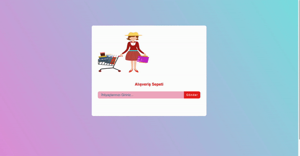

# Alışveriş Sepeti Projesi

Bu proje, kullanıcıların çevrimiçi alışveriş sepeti oluşturmasına, öğe eklemesine, çıkarmasına ve sepetlerini düzenlemesine izin veren bir web uygulamasını içerir.

## Temel İşlevselliğimiz

1. **Alışveriş Sepeti Oluşturma:** Kullanıcılar hesap oluşturarak veya misafir olarak alışveriş sepeti oluşturabilirler.

2. **Öğe Ekleme ve Çıkarma:** Kullanıcılar, ürünleri sepetlerine ekleyebilir veya sepetlerinden çıkarabilirler.

3. **Sipariş Düzeltme:** Kullanıcılar, sepetlerindeki öğelerin miktarını veya diğer detayları düzeltebilirler.

4. **Uyarılar:** Kullanıcılara öğe eklenmesi, çıkarılması veya sipariş düzeltilmesi gibi önemli olaylarda bilgilendirme yapılır.

## Teknolojiler

- **Frontend:** HTML, CSS, JavaScript, 

<h2>Ekran Görüntüsü</h2>

